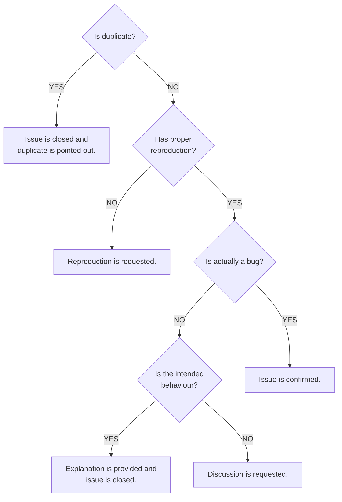

# Contributor Manual

Contributions of any size and skill level are welcomed. Whether a typo is fixed, a test is improved, or a new feature is added, a great appreciation is given for the help in making Changesets better.

> [!Tip]
> **New to open source?**
> The [first-contributions](https://github.com/firstcontributions/first-contributions) repository can be reviewed for helpful tips on getting started.

## Quick Guide

### Prerequisites

```javascript
node: "^22.11 || ^24 || >=26"
pnpm: "^11.5.x"
```

The use of [Corepack](https://nodejs.org/api/corepack.html) is recommended to manage pnpm automatically, since the exact version is pinned in `package.json`.

### Setting up the local repo

The repository is cloned and dependencies are installed by executing the following commands:

```shell
git clone https://github.com/<username>/changesets.git
cd changesets
pnpm install
pnpm build
```

> [!Important]
> The `pnpm build` command must always be run after cloning or pulling changes. Packages in this monorepo are imported from each other's compiled `dist/` directories, so type-checking and test failures will be caused if the build step is skipped.

A `.git-blame-ignore-revs` file is provided to skip over repo-wide formatting commits. It should be configured locally so that `git blame` stays useful:

```shell
git config --local blame.ignoreRevsFile .git-blame-ignore-revs
```

### Development commands

All packages are built once by running:

```shell
pnpm build
```

The build is started in watch mode by running:

```shell
pnpm watch
```

All tests are run in watch mode by running:

```shell
pnpm test
```

All tests are run once by running:

```shell
pnpm test run
```

TypeScript checks are run across the workspace by running:

```shell
pnpm types:check
```

ESLint is run by running:

```shell
pnpm lint
```

Formatting is checked by running:

```shell
pnpm format
```

Formatting is auto-fixed by running:

```shell
pnpm format:fix
```

All checks are run sequentially by executing:

```shell
pnpm check-all
```

### Local testing of the CLI

Local testing of the CLI is achieved by first executing `pnpm build` (which is necessary to update all files used within the project). Subsequently, commands such as `pnpm changeset add` can be run directly, as `workspace:` protocols are utilized in the `package.json` for those packages.

---

## Repository Overview

A `pnpm` monorepo is utilized. All published packages are contained within the `packages/` directory — the vast majority are public and independently versioned on npm. The only private package is `@changesets/color`, which is used within the repo but is not intended as a public API.

Work will most often be done in `@changesets/cli` — the `changeset` binary, all command implementations, and the interactive prompt layer are housed here.

Beyond the CLI, the packages are divided into natural groups:

- Changelog generators: `@changesets/changelog-git` and `@changesets/changelog-github`.
- The release pipeline: `@changesets/read`, `@changesets/parse`, `@changesets/assemble-release-plan`, `@changesets/get-release-plan`, and `@changesets/apply-release-plan`.
- Shared foundations: `@changesets/types`, `@changesets/config`, and `@changesets/errors`.
- Utility packages: `@changesets/git`, `@changesets/pre`, `@changesets/write`, `@changesets/get-dependents-graph`, `@changesets/get-github-info`, `@changesets/should-skip-package`.

---

## CLI Architecture

Time will be saved when adding or modifying commands if the CLI structure is understood.

### How commands are wired up

Argument parsing is handled by [cac](https://github.com/cacjs/cac). All commands are registered in `packages/cli/src/cli.ts`, and implementations are lazily imported via a dynamic `import()` inside the `.action()` handler. Every command's raw options object is run through `normalizeOptions()` before being passed to the implementation.

The top-level entry point is `packages/cli/src/index.ts`. It is here that `cli.parse()` is called, an `intro()` banner is shown, and execution is wrapped in a try/catch that handles `ExitError` and `InternalError`.

### Interactive prompts

All user-facing interactive prompts are built on [@clack/prompts](https://github.com/bombshell-dev/clack). Every prompt is routed through a wrapper in `packages/cli/src/utils/cli-utilities.ts`.

The wrappers provided are `askConfirm`, `askList`, `askMultiselect`, and `askQuestion`. A highlighted warning box is rendered by `importantWarning`. Every wrapper is backed by an internal `cancelable()` helper that intercepts Ctrl+C.

For non-interactive output, `log` is imported directly from `@clack/prompts`. For long-running async operations, `spinner()` is used.

### Adding a new command

1. The command must be registered in `cli.ts` with `.command()`, `.option()`, and `.action()`.
2. The implementation must be created under `packages/cli/src/commands/<name>/index.ts` and a named function must be exported.
3. For interactive prompts, the wrappers from `cli-utilities.ts` must be used.
4. For non-interactive output, `log` from `@clack/prompts` must be used.

---

## Testing

Tests are written with [Vitest](https://vitest.dev/) and are located alongside source files. For standalone utility packages, they are typically found at `src/*.test.ts`; for CLI commands, they are found under `src/commands/<name>/index.test.ts` or `src/commands/<name>/__tests__/`.

To run all test, run:

```shell
pnpm test
```

To run all test once, run:

```shell
pnpm test run
```

### Running a single test

A single test file can be run by specifying the path:

```shell
pnpm test packages/cli/src/commands/add/__tests__/add.test.ts
```

If a single test case is to be run, the `it` or `describe` functions must be postfixed with `.only`:

```javascript
describe.only("description", () => {
  it.only("description", () => {})
})
```

### Test utilities

Helpers for creating temporary project fixtures are provided by the internal `@changesets/test-utils` package:

- `testdir(files)` — A temp directory is created.
- `gitdir(files)` — A git repository is also initialised.
- `outputFile(dir, path, content)` — An additional file is written into an already-created testdir.
- `silenceLogsInBlock()` — All log output within a `describe` block is suppressed.

## Code Style

Formatting is handled by [oxfmt](https://github.com/nicolo-ribaudo/oxfmt) and linting is handled by [ESLint](https://eslint.org/). Both are enforced in CI.

Conventions to be followed:

- **ESM** is used exclusively.
- Explicit **`.ts` extensions** are used in import paths.
- Barrel `index.ts` re-exports are avoided unless required by the public API.

TypeScript is checked across the whole workspace by running `pnpm types:check`.

## Adding a Changeset

Releases are managed by the project itself. Whenever a change is made that affects published packages, a changeset must be added.

```shell
pnpm changeset
```

The prompts must be followed to select the affected packages and the bump type must be chosen. The created markdown file must be committed alongside the code changes.

Changesets are not needed for documentation edits, test-only changes, or internal refactoring.

## Branches

Active development for the current major version is performed on the `main` branch. 

When features for a new major version are developed, they are targeted at the `next` branch, while updates for the current major continue to be received on `main`.

## Releases

Releases are handled automatically by Changesets. A branch named `changeset-release/main` is automatically generated, managed, and updated. Once this branch is merged, packages are automatically bumped, the changelog is written, and a new version of all included packages is published to npm.

## Pull Requests

The `main` branch must be targeted for both bug fixes and new features unless a new major version is targeted at the `next` branch. CI checks must be passed before merging is allowed. The checks included are: build, tests on Node 22 / 24 / 26, TypeScript type-checking, ESLint, and formatting. It is recommended to run `pnpm check-all` before committing.

## For Maintainers

Guidance for maintainers of the repository is provided in this section.

### Issue Triaging Workflow


