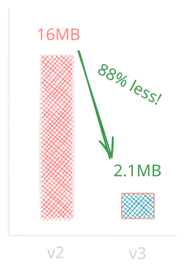
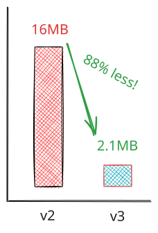
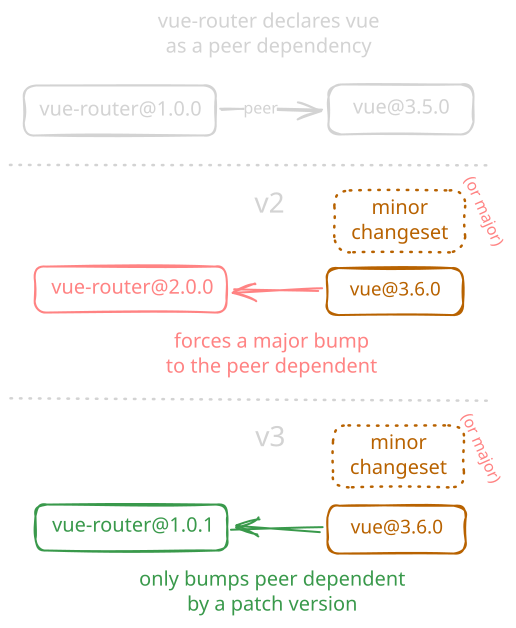
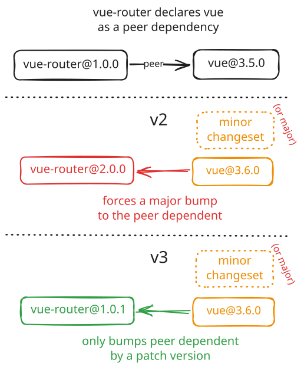
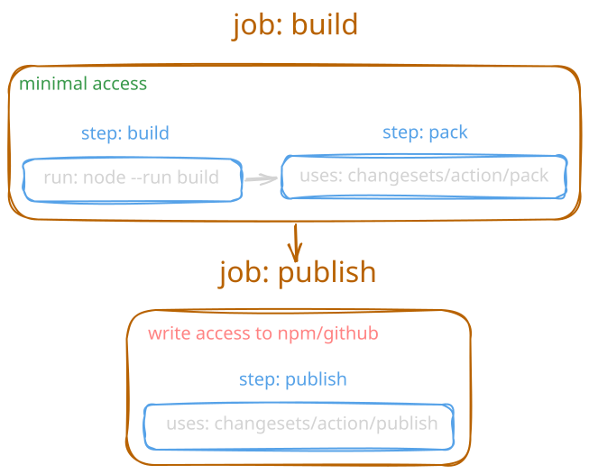
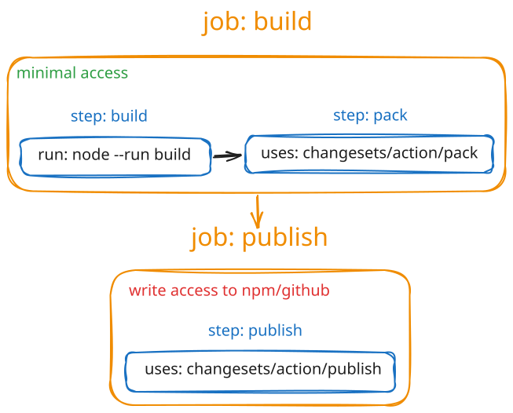
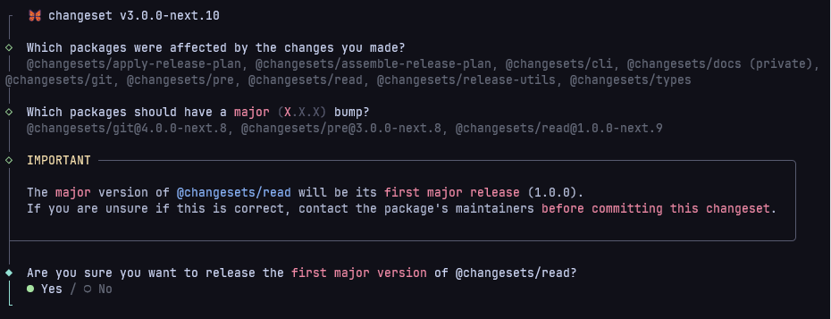

{loading="eager"}

# Announcing Changesets v3

_11 August 2026_

Today, we are excited to announce the release of Changesets v3!

Since the release of v2 seven years ago, this new version brings a host of improvements, cleanups, and modernizations to the Changesets CLI and its packages, and stands as a stepping stone for more ambitious changes we have planned for the future.

Quick links:

- [What is Changesets?](../guide/getting-started.md#what-is-changesets)
- [Frequently Asked Questions](../faq.md)
- [Migrate from v2 to v3](../guide/migration.md)
- [Changelog](https://github.com/changesets/changesets/blob/main/packages/cli/CHANGELOG.md#300)
- [Chat on Discord](https://chat.changesets.dev)

If you or your company uses Changesets, you can help support our work to improve and evolve the project via our <OCLogo /> [Open Collective](https://opencollective.com/changesets) or 💖 [GitHub Sponsors](https://github.com/sponsors/changesets).

## The New Stuff

::: danger Breaking changes
Check out the [Migrate from v2 to v3](../guide/migration.md) guide for a full list of breaking changes.
:::

### Documentation Website

You are currently reading this post on our new website: https://changesets.dev!

With new and re-written docs, we hope this makes it easier to get started with Changesets and find the information you need.

### Modernized Tooling

All Changesets packages have been updated to ESM-only and require Node.js `^22.11 || ^24 || >=26`. The install size and number of dependencies have also been greatly reduced:

- Install size: 16.1MB -> 2.1MB
- Dependencies: 95 -> 39

Internally, we are now using [pnpm](https://pnpm.io), [tsdown](https://tsdown.dev), [rolldown](https://rolldown.rs), [vitest](https://vitest.dev), [oxfmt](https://oxc.rs/docs/guide/usage/formatter.html), and more to develop and build our packages.

{.dark .no-shadow width="200"}
{.light .no-shadow width="200"}

### Less aggressive peer dependency bumping

Previously, if Changesets saw a minor version bump, it would bump peer dependents by a **major** version, even if dependent's usage of the package hasn't been broken.

Now, all change types will bump peer dependents by a **patch** version, while authors can still mark the dependent as having a major change in the same changeset file if needed.

This has been the most requested change to Changesets for years (as can be seen in the [closed issues](https://github.com/changesets/changesets/pull/2090)), and we're happy to finally release it!

{.dark .no-shadow width="420"}
{.light .no-shadow width="420"}

### More robust and flexible version, pack, and publish flows

We have created new commands and GitHub Actions to improve automated publishing workflows.

This allows users to implement a "build, pack, and publish" flow,
[the recommended way to publish packages by the e18e community](https://e18e.dev/docs/publishing.html#standard-workflow).

Check out the new [Automating Changesets](../guide/automating#how-do-i-run-the-version-and-publish-commands) guide for more information.

::: info Regarding staged publishing
We are working on it, and it will be included in the next feature update.
:::

<!-- https://lexidraw.app/#atproto=did:plc:skqg5gindwkuzjmjub6db6yn,3msdmimnqlf2s -->

{.dark .no-shadow width="500"}
{.light .no-shadow width="500"}

### Improved CLI argument parsing and UX

Changesets now uses [`cac`](https://npmx.dev/cac) for CLI arguments and help messages, and [`@clack/prompts`](https://npmx.dev/@clack/prompts) for CLI prompts and rendering, which should make the CLI prettier and easier to use.

<!-- https://lexidraw.app/#atproto=did:plc:skqg5gindwkuzjmjub6db6yn,3mskqppq5nk2u -->

### Use installed formatters to format changelogs

Changesets now defaults to using any supported formatters it finds installed in the project, instead of pulling in a (potentially duplicate) Prettier version.

It supports detecting `prettier`, `oxfmt`, `deno`, and `dprint`, using our new [`@changesets/format`](https://npmx.dev/@changesets/format) package.

Check the [migration guide](../guide/migration.md#replace-prettier-with-format) for how to configure it.

## Thanks

This release was lead by the new Changesets team, including:

- Mateusz Burzyński <Socials bsky="andarist.bsky.social" github="Andarist" />
- Bjorn Lu <Socials bsky="bluwy.me" github="bluwy" />
- Adam Haglund <Socials bsky="haglund.dev" github="beeequeue" />

We'd also like to thank everyone who has helped discuss, test, and improve Changesets during this development, including:

[0xsarawut.base.eth](https://github.com/0xsarawut), [999](https://github.com/Hansanghyeon), [Aaron Casanova](https://github.com/aaronccasanova), [Abhijeet Singh](https://github.com/cseas), [Adam Butterfield](https://github.com/adbutterfield), [Adam Fanello](https://github.com/kernwig), [Adam Trager](https://github.com/Nfinished), [Adriano de Azevedo](https://github.com/drianoaz), [Akino](https://github.com/akinoccc), [Alan Norbauer](https://github.com/altano), [Aleksandr Dyuzhikov](https://github.com/reabiliti), [Alex](https://github.com/alex-ju), [Alex Page](https://github.com/alex-page), [Alexander Chashchin](https://github.com/alexamy), [Alexander Kachkaev](https://github.com/kachkaev), [Alexander Kireyev](https://github.com/chatman-media), [Ali Zeaiter](https://github.com/alizeait), [An Phi](https://github.com/akphi), [Anders Bech Mellson](https://github.com/mellson), [Andres Maqueo](https://github.com/AndresMaqueo), [Angelo Ashmore](https://github.com/angeloashmore), [Antoine Kingue](https://github.com/antoinekm), [anujshah3](https://github.com/anujshah3), [Ari](https://github.com/aribakker), [Ari Perkkiö](https://github.com/AriPerkkio), [Ashish Padhy](https://github.com/Shurtu-gal), [Aubron Wood](https://github.com/Aubron), [axistore80-coder](https://github.com/axistore80-coder), [Bastien Robert](https://github.com/bastienrobert), [Bbjj88h](https://github.com/Bbjj88h), [Belinda Cao](https://github.com/caohuilin), [Ben McCann](https://github.com/benmccann), [Ben Scott](https://github.com/BPScott), [bencergazda](https://github.com/bencergazda), [Benjamin Sehl](https://github.com/benjaminsehl), [Benny Powers](https://github.com/bennypowers), [Bert B](https://github.com/bertybot), [Bert De Geyter](https://github.com/TheHolyWaffle), [Beth Griggs](https://github.com/BethGriggs), [Bill Collins](https://github.com/mrginglymus), [Bojan Rajh](https://github.com/bojanrajh), [brandi hinojosa](https://github.com/bluluvinn), [Brandon Keepers](https://github.com/bkeepers), [Brian Cooper](https://github.com/coopbri), [Brian Espinosa](https://github.com/brianespinosa), [Bruno](https://github.com/bgfernandes), [Caleb Jasik](https://github.com/jasikpark), [Cameron Dutro](https://github.com/camertron), [Cefn Hoile](https://github.com/cefn), [Chance Strickland](https://github.com/chaance), [Changwan](https://github.com/WooWan), [Christian Kaisermann](https://github.com/kaisermann), [Clifford Fajardo](https://github.com/cliffordfajardo), [CNOCTAVE](https://github.com/CNOCTAVE), [Coby Sher](https://github.com/CobyPear), [Codecov Comments Bot](https://github.com/codecov-commenter), [Codes](https://github.com/codyaverett), [dagecko](https://github.com/dagecko), [dalmena](https://github.com/dalmena), [Daniel Cousens](https://github.com/dcousens), [Danilo Delizia](https://github.com/ddeliziact), [danilo neves cruz](https://github.com/cruzdanilo), [Dave Bitter](https://github.com/DaveBitter), [David Glasser](https://github.com/glasser), [David Moling](https://github.com/davgenaec), [David Novakovic](https://github.com/dpnova), [David Register](https://github.com/dmregister), [Dei Vilkinsons](https://github.com/vilkinsons), [DevRCRun](https://github.com/DevRCRun), [Diego Muracciole](https://github.com/diegomura), [Dimava](https://github.com/Dimava), [Dominik "Pipo" Alexander](https://github.com/DerPipo), [Dotan Simha](https://github.com/dotansimha), [Dustin Deus](https://github.com/StarpTech), [Dustin Savery](https://github.com/dusave), [Eduardo Ferras](https://github.com/eduardoferras), [Elliot Nelson](https://github.com/elliot-nelson), [Emad QEAD Alshamiri](https://github.com/Emadalshamery), [Emanuele Stoppa](https://github.com/ematipico), [Emma Hamilton](https://github.com/emmatown), [Emmet Moore](https://github.com/emmet-opinionx), [Eran Shapira](https://github.com/eranshapira), [Eric Egli](https://github.com/eegli), [Ernesto García](https://github.com/ernestognw), [Felix Schneider](https://github.com/trueberryless), [Feng Yu](https://github.com/F3n67u), [Florian Bischoff](https://github.com/florianbepunkt), [Forever17s](https://github.com/Forever17s), [Frank122480](https://github.com/Frank122480), [Fred](https://github.com/MrTibbles), [Freddie Laycock](https://github.com/freddielaycock), [frikke](https://github.com/frikke), [Gonzamany](https://github.com/Gonzamany), [Gyorgy Kallai](https://github.com/gyurielf), [Harsha Venugopal](https://github.com/harsha-venugopal-ledn), [Herman Jensen](https://github.com/h3rmanj), [hnkƶ](https://github.com/kazuki-hanai), [Homa Wong](https://github.com/unional), [Hovhannes Babayan](https://github.com/bhovhannes), [Ian](https://github.com/ifkb99), [Ian Sanders](https://github.com/iansan5653), [Ian Storm Taylor](https://github.com/ianstormtaylor), [Ingvald Lorentzen](https://github.com/ingvaldlorentzen), [Ivan Banov](https://github.com/ivanbanov), [Ivan Vlatković](https://github.com/ivandotv), [ivanm696](https://github.com/ivanm696), [J Garcia](https://github.com/JGJP), [Jack](https://github.com/itsjxck), [Jack Leslie](https://github.com/jackleslie), [jacksonneal](https://github.com/jacksonneal), [Jagaban2](https://github.com/Jagaban2), [Jake Bailey](https://github.com/jakebailey), [Jake Ginnivan](https://github.com/JakeGinnivan), [Jake Pelter](https://github.com/JPelter), [Jakub Mazanec](https://github.com/jakubmazanec), [James](https://github.com/Zamiell), [Jan Gazda](https://github.com/1oglop1), [Jan Jonas](https://github.com/janjonas), [Janosh Riebesell](https://github.com/janosh), [javier-garcia-meteologica](https://github.com/javier-garcia-meteologica), [Jerel Miller](https://github.com/jerelmiller), [JessDeez](https://github.com/JessDeez), [Jl2756550](https://github.com/Jl2756550), [Joaquín Pérez](https://github.com/jperezrealini), [Joe Reed](https://github.com/joerobot), [John Undersander](https://github.com/john-u), [Jolyn](https://github.com/internettrans), [Jonathan Dang](https://github.com/jonakyd), [Jonathan Sheely](https://github.com/jsheely), [Jordan Collins](https://github.com/JordanCollins), [Joren Broekema](https://github.com/jorenbroekema), [Jose Francisco 'Kiko' Verdú Gambín](https://github.com/Kikobeats), [Josh Wooding](https://github.com/joshwooding), [Joshua Pendragon](https://github.com/graffhyrum), [JounQin](https://github.com/JounQin), [Juan Picado](https://github.com/juanpicado), [Julien Deniau](https://github.com/jdeniau), [Julien Karst](https://github.com/JulienKode), [Julio L. Muller](https://github.com/juliolmuller), [Justin Halsall](https://github.com/Juice10), [jyc.dev](https://github.com/jycouet), [Kanamio](https://github.com/fz6m), [Kauhsa](https://github.com/Kauhsa), [KBS](https://github.com/youdie006), [Keccake256 or Felix](https://github.com/Fool256), [Kenrick](https://github.com/kenrick95), [kingsarhan](https://github.com/kingsarhan), [Kristen T. Tran](https://github.com/kristentr), [Kunal Nagar](https://github.com/kunalnagar), [kwangure](https://github.com/kwangure), [Leo Chiu](https://github.com/leochiu-a), [Léo Pradel](https://github.com/pradel), [Liam O'Boyle](https://github.com/elyobo), [lilke3113](https://github.com/lilke3113), [LIU Yiyuan](https://github.com/4mthxmas20), [Lubos](https://github.com/mrlubos), [Lucia Quirke](https://github.com/luciaquirke), [Luis Adame Rodríguez](https://github.com/luisadame), [m-shaka](https://github.com/m-shaka), [Maikel van Dort](https://github.com/Netail), [Manu MA](https://github.com/manucorporat), [Marco de Jongh](https://github.com/marcodejongh), [Marco Pasqualetti](https://github.com/marcalexiei), [Marek Sýkora](https://github.com/MarekSyk), [Mark Ladyshau](https://github.com/mrkldshv), [Mark Omarov](https://github.com/mark-omarov), [Mark Skelton](https://github.com/mskelton), [Martin Blom](https://github.com/LeviticusMB), [Matic Zavadlal](https://github.com/maticzav), [Matt](https://github.com/mattlunn), [Matt](https://github.com/TheeMattOliver), [Matthias Prost](https://github.com/matthprost), [Matthieu van den Biggelaar](https://github.com/loydle), [Maximilian Franzke](https://github.com/mfranzke), [Melanie Sumner](https://github.com/MelSumner), [Michael Li](https://github.com/michael-land), [Michal Marek](https://github.com/mmarekbb), [Mihkel Eidast](https://github.com/mihkeleidast), [Minh Nguyen](https://github.com/NMinhNguyen), [Minh Tu K.Tran](https://github.com/krsjenswbp), [mino](https://github.com/mino01x), [Miszo Radomski](https://github.com/miszo), [mixelburg](https://github.com/mixelburg), [Mohamed Abed](https://github.com/SABRYX), [Moritz Klack](https://github.com/moklick), [mruizpiza@icloud.com](https://github.com/Chavrzp28), [Murat Aslan](https://github.com/murataslan1), [Nazreen](https://github.com/nazreen), [Nelvia-07](https://github.com/Nelvia-07), [Nick Fujita](https://github.com/nickfujita), [Nicola Molinari](https://github.com/emmenko), [Nicolás Alonso](https://github.com/nicoalonsop), [Noviny](https://github.com/Noviny), [odan](https://github.com/odanado), [Oleksii Shytikov](https://github.com/oshytiko), [Oli Juhl](https://github.com/olivermrbl), [Omer Aplak](https://github.com/omeraplak), [Øyvind Saltvik](https://github.com/fivethreeo), [Pascal Jufer](https://github.com/paescuj), [Patrick Fulton](https://github.com/pfulton), [Patrick McElhaney](https://github.com/pmcelhaney), [Patrik Oldsberg](https://github.com/Rugvip), [Patryk Tomczyk](https://github.com/patzick), [Pavel Pomerantsev](https://github.com/pomerantsev), [Peersky](https://github.com/peersky), [Peter Siska](https://github.com/peschee), [Phil Tremblay](https://github.com/philtremblay), [Pierson M](https://github.com/piemot), [Pilou](https://github.com/plmercereau), [Qingyu Wang](https://github.com/colinaaa), [Quinn J Neumiiller](https://github.com/quinnjn), [Rafał Makara](https://github.com/rmakara), [ramseyfeng](https://github.com/ramseyfeng), [rananisarsb51214](https://github.com/rananisarsb51214), [Rasso Hilber](https://github.com/hirasso), [Rayan Salhab](https://github.com/cyphercodes), [README.md](https://github.com/leuasseurfarrelds247-arch), [René Schubert](https://github.com/renet), [Rijk van Zanten](https://github.com/rijkvanzanten), [Rob Phoenix](https://github.com/robphoenix), [Rodri](https://github.com/RodrigoHamuy), [Rohit Gohri](https://github.com/rohit-gohri), [romankulkovsf](https://github.com/romankulkovsf), [Ross Stenersen](https://github.com/rossiam), [Royston Shufflebotham](https://github.com/RoystonS), [Russell Bicknell](https://github.com/bicknellr), [Ruud Andriessen](https://github.com/ruudandriessen), [Ryan Bas](https://github.com/ryanbas21), [Ryan Gilbert](https://github.com/0xRAG), [Ryan Wilson-Perkin](https://github.com/ryanwilsonperkin), [Saleemraza](https://github.com/Siloshah), [Sam Lanning](https://github.com/s0), [Sam Rose](https://github.com/sam-b-rose), [Sam Tsai](https://github.com/samtsai), [Samira El rhoudri](https://github.com/Samira900i8uu), [Sarah Bannister](https://github.com/slbannister), [Sean Bray](https://github.com/OjiCode), [Sean Wood](https://github.com/WoodyWoodsta), [Sébastien Vanvelthem](https://github.com/belgattitude), [Seokrin Taron Sung](https://github.com/taronsung), [Seth Bertalotto](https://github.com/redonkulus), [Seth Silesky](https://github.com/silesky), [Sidharth Vinod](https://github.com/sidharthv96), [Simon Farshid](https://github.com/Yonom), [Simon Warta](https://github.com/webmaster128), [situ2001](https://github.com/situ2001), [Stefanos Anagnostou](https://github.com/anagstef), [Steven Jimenez](https://github.com/stevethedev), [Steven Scaffidi](https://github.com/sscaff1), [Surai](https://github.com/sdirosa), [Sven](https://github.com/svenvoskamp), [Tatsunori Uchino](https://github.com/tats-u), [Tee Ming](https://github.com/teemingc), [Teodor Raykov](https://github.com/tedraykov), [TheMikeyRoss](https://github.com/TheMikeyRoss), [Theo Ephraim](https://github.com/theoephraim), [Thomas Beer](https://github.com/Tommypop2), [Thulof Qu](https://github.com/Thulof), [Timoteo Borgobello](https://github.com/tbor00), [Tmk](https://github.com/tmkx), [Tom French](https://github.com/TomAFrench), [Tom Howard](https://github.com/tompahoward), [Tom Sherman](https://github.com/tom-sherman), [Tommy D. Rossi](https://github.com/remorses), [Trevor Scheer](https://github.com/trevor-scheer), [Trivikram Kamat](https://github.com/trivikr), [Uiolee](https://github.com/uiolee), [Vas Sudanagunta](https://github.com/vassudanagunta), [Vemund Eldegard](https://github.com/vemundeldegard), [Viktor Varland](https://github.com/varl), [Vitor Barbosa](https://github.com/vitorhsb), [Vlad Tereshyn](https://github.com/vtereshyn), [vladislav doster](https://github.com/vladdoster), [Vx-V](https://github.com/Vx-V), [Walt Park](https://github.com/walt1992), [wei-wei](https://github.com/wuweiweiwu), [Whaletrucker Reef](https://github.com/scutuatua-crypto), [Will Weaver](https://github.com/wweaver), [william-will-angi](https://github.com/william-will-angi), [willo-icon](https://github.com/willo-icon), [with-heart](https://github.com/with-heart), [wotan-allfather](https://github.com/wotan-allfather), [wujekbogdan](https://github.com/wujekbogdan), [xiewei](https://github.com/xccxcs), [Yehuda Katz](https://github.com/wycats), [yonran](https://github.com/yonran), [Younsang Na](https://github.com/nayounsang), [Yuri Pieters](https://github.com/MageJohn), [Zach Bellay](https://github.com/zachbellay), [Zach Cowan](https://github.com/zacowan), [zanminkian](https://github.com/zanminkian), [Zoltan Kochan](https://github.com/zkochan), [zthxxx](https://github.com/zthxxx), [조상현](https://github.com/chosanghyeon-dev), [차승호](https://github.com/Sh031224), and [肥康](https://github.com/NicoKam)

If you're interested in helping the future of Changesets, come join us on <DiscordLogo /> [Discord](https://chat.changesets.dev)!

As Changesets remains one of the most popular release tool in the npm ecosystem, with more than 3M weekly downloads, we'd like to thank everyone who has supported Changesets over the years.
